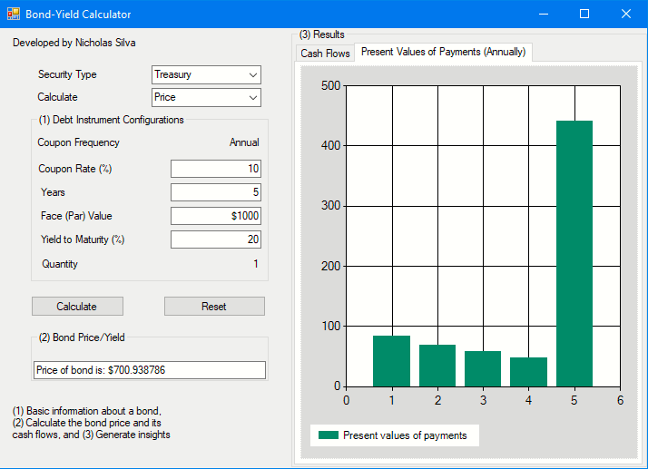
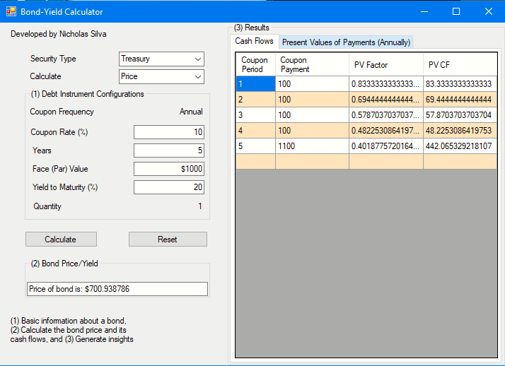
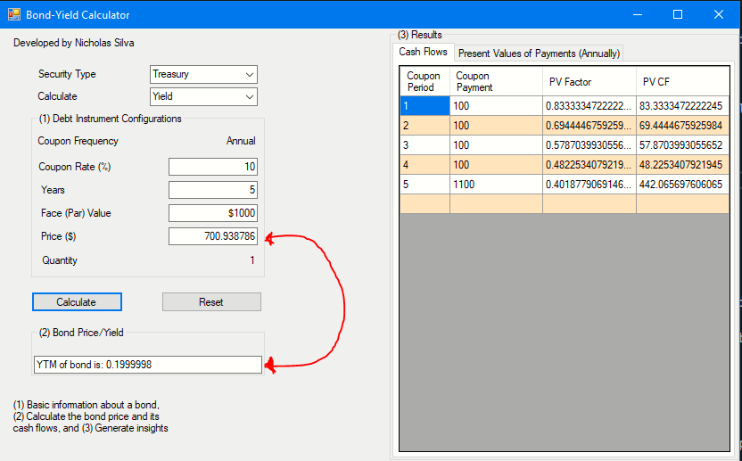
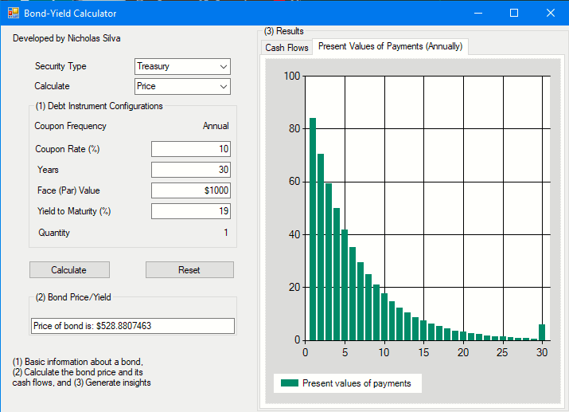
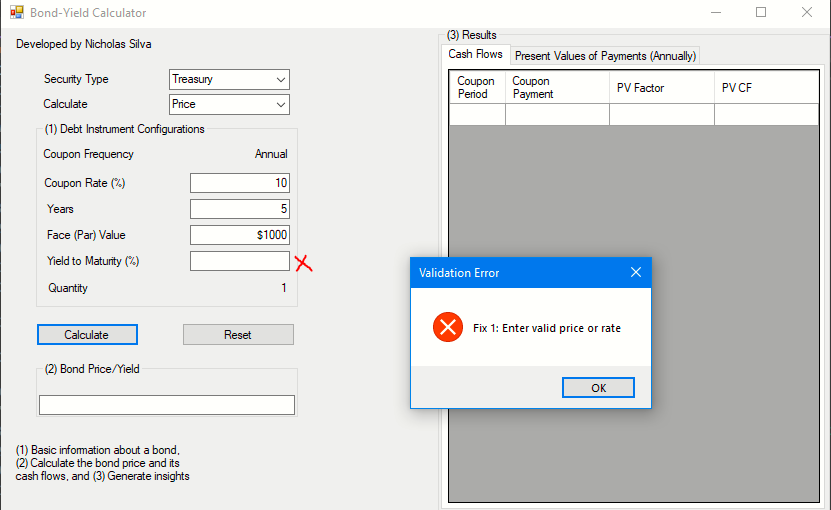
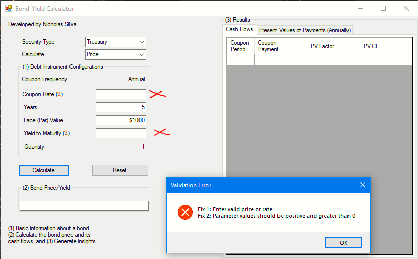

# Bond Yield Calculator

This repository contains a simple bond yield calculator that determines the present value of future cash flows from a bond, based on compound interest calculations and discount rates.

### Background:
Fixed-income securities, such as bonds, are priced based on the timing and amount of cash flows they provide. Cash received sooner is more valuable than cash received later because it can be reinvested. This calculator utilizes compound interest calculations to discount future cash flows back to their present value.

### How to Use:
1. Clone this repository to your local machine.
2. Open the GUI interface and follow the provided images to input the necessary parameters such as cash flow, time until receipt, and the discount rate.
3. Price and yield are inversley related with a tolerance of 1e-5.
[](images/BondCalcPriceChart.png)
[](images/BondCalcPriceSnippet.png)
[](images/BondCalcYieldSnippet.png)
4. Test different bond parameters 
[](images/BondCalcPriceChart2.png)
5. Input validation prevent crashes due to invalid inputs.
[](images/InputValidation1.png)
[](images/InputValidation2.png)


### Code Structure:
The core functionality of the bond yield calculator is implemented in the `TreasuryCalculator` class within the `TreasuryCalculator.cs` file. Here's a summary of its main functionalities:

1. **CalcPrice Method**: Calculates the present value of cash flows and bond price based on the provided bond parameters.

2. **RerunCalcPrice Method**: Recalculates cash flows without updating cash flow data.

3. **CalcYield Method**: Approximates the bond yield (YTM) using the Newton-Raphson method.

4. **CalculatePriceCashFlows Method**: Performs the calculation of present values of cash flows for both price and yield calculations.

5. **CalculateYield Method**: Implements the Newton-Raphson method to approximate the bond yield.

6. **CalculatePriceDerivative Method**: Calculates the derivative of the bond price with respect to the bond yield at each time period.

### Calculating Bond Price:
The bond price can be calculated using the present value formula:

 P = ∑(C / (1 + r)^t) + (F / (1 + r)^T)

Where:
- `C` = Coupon payment
- `F` = Face value of the bond
- `r` = Yield to maturity (YTM)
- `T` = Time until maturity in years

## Approximating Bond Yield (YTM):
The bond yield (YTM) `r` can be approximated using the Newton-Raphson method:
1. Initialize an initial guess for YTM, denoted as `r_0`.
2. Calculate the bond price `P` using the present value formula with the initial guess for YTM.
3. Calculate the derivative of the bond price with respect to YTM, denoted as `dP/dr`.
4. Update the guess for YTM using the formula:

 r_1 = r_0 - (P - M) / (dP/dr)


Where:
- `r_1`  = Updated guess for YTM
- `M` = Market price of the bond
- `P` = Bond price calculated using the initial guess
- `dP/dr` = Derivative of bond price with respect to YTM

5. Repeat steps 2-4 until the absolute difference between the calculated bond price and the market price is within a specified tolerance.

These numerical methods allow for efficient calculation of bond prices and yields, considering the timing and amount of cash flows provided by the bond parameters.

## Convergence Issues and Improvement Strategies:
Convergence issues may arise during the approximation of bond yield (YTM) using the Newton-Raphson method. Strategies for improving convergence include:
- **Robust Initial Guess**: Providing a reasonable initial guess for YTM based on market conventions or historical data.
	- My initial guess for YTM expressed as a rate            
	- ``` double estimatedYield = 0.1; ```

- **Adaptive Methods**: Using adaptive techniques to adjust the step size or refine the initial guess based on the behavior of the function.
	- In my code, I used a scalor factor which is a rouge estimation. Calculate the change in yield and scale. Before scaling, the delta wasn't small enough to update the estimated yield 
	- ``` double delta = (priceError / priceDerivate) * .0001; ```
- **Error Handling**: Handling exceptional cases gracefully, such as divergent iterations or non-convergence, by providing feedback to users and possibly adjusting input parameters.


### Contributions:
Contributions to enhance the functionality or efficiency of the bond yield calculator are welcome. Feel free to fork this repository and submit pull requests with your changes.

### License:
This project is licensed under the MIT License. See the LICENSE file for details.

### Disclaimer:
This calculator provides estimates and should not be used as financial advice. Always consult with a qualified financial advisor before making investment decisions.
